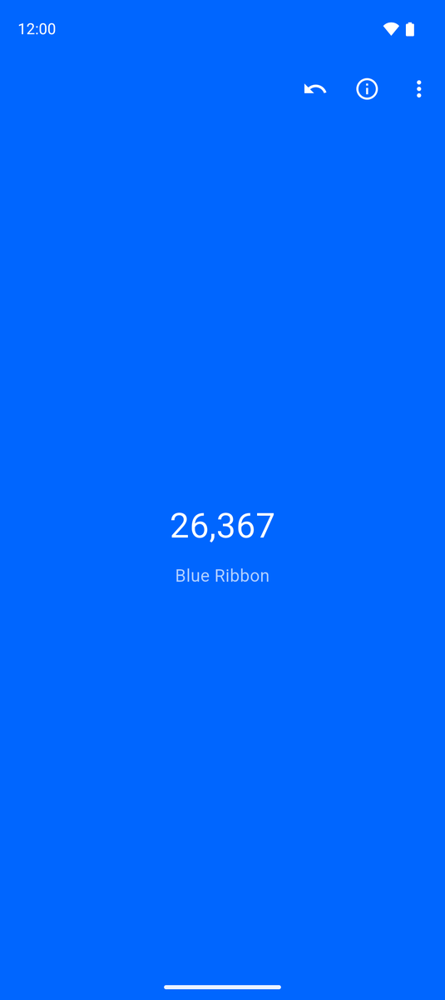
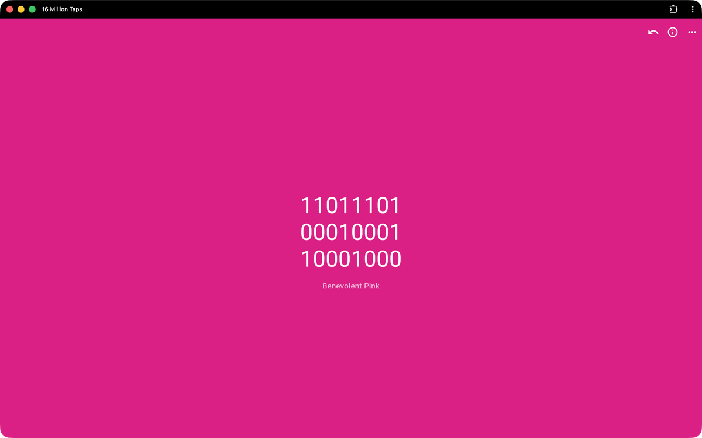
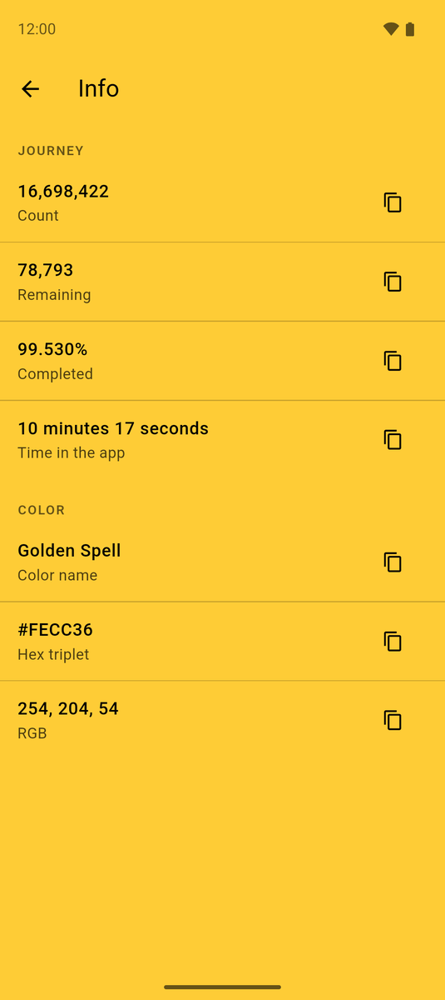

# 16 Million Taps

[](https://github.com/TheHelloWorldWriter/16MillionTaps/releases)
[](LICENSE)
[](https://github.com/TheHelloWorldWriter/16MillionTaps)


A calm, mantra-like color tap counter, for the web and Android.

Each tap fills the whole screen with a color whose RGB value equals your count so far: 0 is black, 255 is blue, 65,280 is green, and 16,777,215 is white.

A tapping app seems kind of useless, doesn't it? Try it for a few minutes, or a few thousand taps. You might notice your mind wandering off, relaxing, maybe quietly working on some forgotten problem in the background. It's a kind of mantra, with taps in place of the repeated word.

Tap for a few seconds or for an hour - it's up to you, and the next time you open it you continue exactly where you left off. It's fine if you never reach 16 million (though the colors up there are beautiful). As usual, the journey is the destination.

I first wrote 16 Million Taps years ago as a small native Android app. This is a rewrite in Flutter, so it now runs in the browser as well as on Android, from one codebase. The original, "16 Million Taps Classic", stays where it is, unchanged - this is its cross-platform successor.

<p align="center">
  
  &nbsp;&nbsp;
  
  &nbsp;&nbsp;
  
</p>

## Try it

Open it in your browser, nothing to install: **https://16milliontaps.thehww.app/**

You can also install it from the browser as an app.

## What it does

- Tap anywhere; the screen fills with the color matching your count, from black (0) to white (16,777,215).
- Count in decimal, binary, octal, or hexadecimal.
- It resumes where you left off, every time.
- Step back one tap, or jump to any number (a cheat that rather defeats the point).
- See a color's name where one exists, plus an Info screen with the hex, RGB, your time, and how far you've come.
- Share the current color as an image.
- Optional soft tap sound and a faint progress line, both off by default; the light or dark theme follows your system.

## Download for Android

Grab the latest APK from the [Releases page](https://github.com/TheHelloWorldWriter/16MillionTaps/releases). The **universal** APK works on any phone - pick that one if you're not sure; the `arm64-v8a` build is smaller if you prefer.

Requires Android 7.0 or newer. If your device blocks the install, allow installing from unknown sources for your browser or file manager (in Settings, under Security or Apps).

## Build it yourself

It's a Flutter app. With the [Flutter SDK](https://docs.flutter.dev/get-started/install) installed:

```sh
flutter pub get
flutter run -d chrome   # run in the browser
flutter run             # run on a connected Android device
flutter build web       # build the web app
flutter build apk       # build the release APKs
```

## Contributing

Found a bug or have an idea? [Open an issue](https://github.com/TheHelloWorldWriter/16MillionTaps/issues/new). If you'd like to fix it yourself, fork the repo, make your change, and open a pull request. Small fixes are welcome.

## License

16 Million Taps is open source under the [MIT License](LICENSE).

---

Made with ❤️ in Oradea, Romania  
https://www.thehelloworldwriter.com
